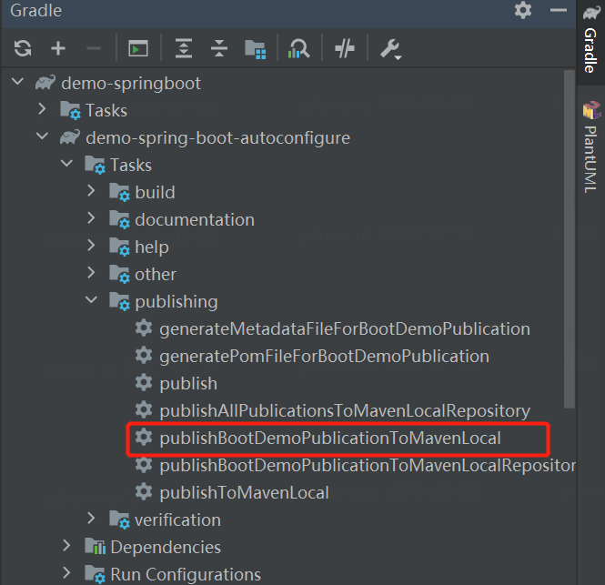

#### 1、`Spring Boot Starter`介绍
`spring boot starter`分为`starter`和`autoconfigure`两个模块
* `autoconfigure`模块：包含自动配置相关代码，例如：`xxxProperties`、`xxxAutoConfiguration`等代码，即根据配置条件自动注入相关`Bean`。
* `starter`模块：该模块主要是依赖`autoconfigure`模块，并额外添加一些其他依赖包（如果需要）。
#### 2、自定义`Spring Boot Starter`开发流程
* 新建一个多模块的空项目，同时新增`starter`和`autoconfigure`两个子模块，项目的`build.gradle`代码如下所示： 
```groovy
buildscript {
    repositories {
        mavenLocal()
        mavenCentral()
    }
}
allprojects {
    group 'com.webank.springboot'
    version '1.0-SNAPSHOT'
}
subprojects {
    // 使用 java-library 插件，才可以使用 api 语法依赖其他包
    apply plugin: 'java-library'
    apply plugin: 'maven-publish'
    dependencies {
        compileOnly 'org.projectlombok:lombok:1.18.24'
        // gradle 5.0以上版本注解处理不再compile classpth，需要增加 annotation processor path
        annotationProcessor 'org.projectlombok:lombok:1.18.24'
    }
    // 配置依赖包的仓库，优先从本地仓库找依赖包
    repositories {
        mavenLocal()
        mavenCentral()
    }

    // 发布jar包到Maven仓库
    publishing {
        publications {
            bootDemo(MavenPublication) {
                from components.java
            }
        }
        // 配置本地仓库为发布的目标仓库，此处如需要可以改成配置为远程仓库
        repositories {
            mavenLocal()
        }
    }
}
```
* `autoconfigure`模块需要在`resources`文件夹下新增`spring.factories`文件，文件路径为：`resources/META-INF/spring.factories`，并在`spring.factories`文件中声明自动装配的配置类，代码如下：
```properties
org.springframework.boot.autoconfigure.EnableAutoConfiguration=\com.webank.springboot.DemoAutoConfiguration
```
即`key-value`的方式，其中`key`是固定的`org.springframework.boot.autoconfigure.EnableAutoConfiguration`,后面的`value`则是自定义的`XXXAutoConfiguration`类的全路径。
* `starter`模块依赖`autoconfigure`模块（注意：需要使用`api`依赖，否则项目中无法引用`autoconfigure`模块中的代码）`starter`模块的`build.gradle`代码如下所示：
```groovy
description='demo-spring-boot-starter'

dependencies {
    api project(":demo-spring-boot-autoconfigure")
}

test {
    useJUnitPlatform()
}
```
* 分别在`starter`和`autoconfigure`模块中，执行`gradle`的`publishing task`，将模块打包发布到仓库中

#### 3、自定义`Spring Boot Starter`使用流程
* 项目中依赖`starter`模块，由于`starter`模块内部已经依赖`autoconfigure`模块，所以项目会自动依赖`autoconfigure`模块代码。